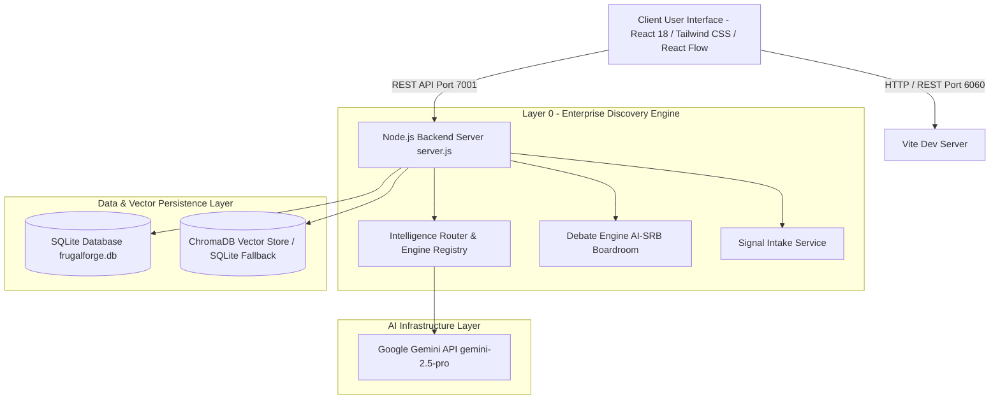

# ValueThread (FrugalForge) 🚀

> **Enterprise AI Spec-Driven Development (SDD) & Requirements Intelligence System**

ValueThread (FrugalForge) is an AI-powered Enterprise Software Specification and Engineering Intelligence platform. It automates the end-to-end SDLC pipeline—transforming unstructured business signals and product ideas into authoritative SpeckIt packages, Functional Specifications (FSD), Agile user stories, architecture blueprints, database DDL schemas, UX wireframes, QA test suites, and audit-ready compliance ledgers.

---

## 🌟 Key Capabilities

* **Dual-Mode SDLC Workflows**:
  * **Greenfield Discovery**: Turn raw business ideas and user prompts into structured SpeckIt specification packages, ERD schemas, UI prototypes, and Jira sprint backlogs.
  * **Brownfield Modernization**: Reverse-engineer legacy codebases (`Code to Spec`), run system impact analysis (`Impact & Gap Specs`), and auto-generate DB migration scripts (`ALTER DDL`).
* **5-Layer SDD Control Plane Architecture**:
  * **Layer 0 - Enterprise Discovery & Signal Intake**: Signal intake, idea framing, debate engine, finance engine, and readiness scoring.
  * **Layer 1 - Cryptographic Evidence Ledger**: Full auditability, prompt tracking, model metrics, and token usage telemetry (`.token_telemetry.json`).
  * **Layer 2 - Requirements & SDD Generators**: Automated generation of SpeckIt packages, functional specs, user stories, and test suites (Gherkin/QA).
  * **Layer 3 - Knowledge Fabric & RAG Grounding**: Semantic grounding using ChromaDB vector database with SQLite vector fallback.
  * **Layer 4 - Spec & Control Plane**: Authoritative baseline spec registry, cascaded spec views, AST artifact graphs, and version lineage trees.
* **AI Software Review Board (AI-SRB)**: Live Multi-Agent Debate Boardroom where autonomous specialized agents (Requirement Agent, Review Agent, Validator Agent) deliberate to enforce architecture and policy standards.
* **Role-Based Persona Workspaces**: Tailored dashboards for **Platform Admin**, **Product Owner**, **Business Analyst**, **Solution Architect**, **Technical Lead**, and **Developer**.
* **Enterprise Integrations**: One-click publishing to **Jira** (epics/stories) and **Confluence** (spec documentation).

---

## 📐 Architecture Overview



---

## 🛠️ Technology Stack

* **Frontend**: React 18, React Router v6, React Flow, Tailwind CSS v3, PostCSS, Vite v5
* **Backend Server**: Node.js HTTP Server (`server.js`) on Port `7001`
* **Database & Persistence**: SQLite (`better-sqlite3`) with WAL mode (`frugalforge.db`)
* **Vector Database**: ChromaDB (`chromadb`) & `@qdrant/js-client-rest`
* **AI Models**: Google Gemini API (`GEMINI_API_KEY` / `VITE_GEMINI_API_KEY`)

---

## 🚀 Quick Start Guide

### 1. Prerequisites
* **Node.js**: v18.0.0 or higher
* **npm**: v9.0.0 or higher
* **Google Gemini API Key**

### 2. Installation

Clone the repository and install the dependencies:

```bash
git clone <repository-url>
cd ValueThread
npm install
```

### 3. Environment Setup

Create a `.env` file from the example configuration:

```bash
cp .env.example .env
```

Set your Google Gemini API Key inside `.env`:

```env
VITE_GEMINI_API_KEY=your_google_gemini_api_key_here
GEMINI_API_KEY=your_server_google_gemini_api_key_here
```

### 4. Running the Project

Start the **Backend API Server** and **Frontend Web Application**:

#### Terminal 1: Backend API Server (Port 7001)
```bash
node server.js
```

#### Terminal 2: Frontend Client (Port 6060)
```bash
npm run dev
```

Open your browser and navigate to:
👉 **`http://localhost:6060`**

---

## 📁 Repository Structure

```
ValueThread/
├── server.js                   # Node.js backend REST API server (Port 7001)
├── db.js                       # SQLite database service & migrations (better-sqlite3)
├── chromaVectorService.js      # ChromaDB enterprise vector database integration
├── embeddingService.js         # Semantic embedding generator for vector RAG
├── frugalforge.db              # SQLite database file
├── .env.example                # Template for API keys & environment variables
├── package.json                # Project dependencies & scripts
├── vite.config.js              # Vite bundler configuration (Port 6060)
├── server/
│   └── layer0/                 # Enterprise Discovery & AI Router sub-modules
│       ├── intelligenceRouter.js
│       ├── debateEngine.js
│       ├── signalIntakeService.js
│       ├── requirementCompiler.js
│       └── evidenceLedger.js
└── src/                        # React Frontend application
    ├── components/             # Reusable UI components (Modals, Badges, Lineage Trees)
    ├── pages/                  # Role-based pages (Layer0, SpeckIt, SpecToStory, TechArch, DB, etc.)
    ├── context/                # Global React context (PageContext)
    ├── services/               # API clients (userService, projectService, agentMappingService)
    ├── main.jsx                # Application routing & layout shell
    └── index.css               # Global Tailwind CSS styling
```

---

## 📊 Core API Endpoints

The backend server (`server.js`) exposes key REST endpoints on port `7001`:

| Endpoint | Method | Description |
| :--- | :--- | :--- |
| `/api/chat/completions` | `POST` | Proxy endpoint for Google Gemini LLM completion tasks |
| `/api/v1/returns` | `POST` / `GET` | Core domain Return Request Tracker endpoints |
| `/api/layer0/signal-intake` | `POST` | Intake raw enterprise signals & user prompts |
| `/api/layer0/debate` | `POST` | Trigger multi-agent AI-SRB debate circle |
| `/api/telemetry/tokens` | `GET` / `POST` | Track prompt & completion token consumption telemetry |
| `/api/vector/search` | `POST` | RAG context retrieval via ChromaDB / SQLite fallback |

---

## 📜 License & Governance

This repository is maintained for Enterprise Spec-Driven Development (SDD) research and development. All rights reserved.